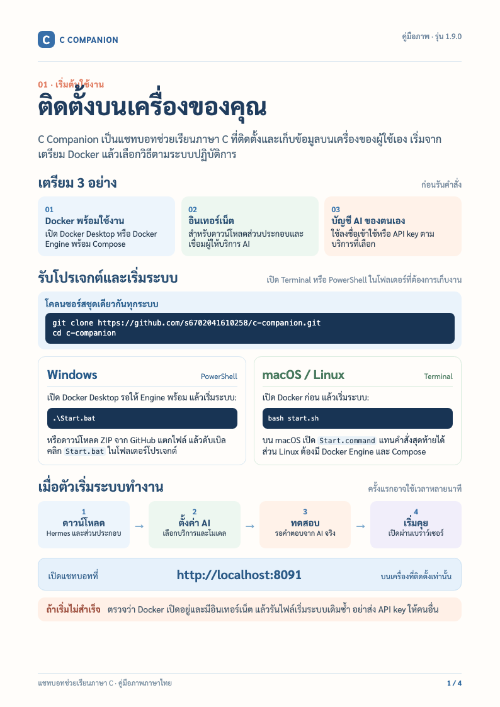

# C Companion

**รุ่นปัจจุบัน 1.9.0** · [ดาวน์โหลดและบันทึกรุ่น](https://github.com/s6702041610258/c-companion/releases/tag/v1.9.0) · คู่มือปรับปรุง 10 ตุลาคม 2569

**แชทบอทช่วยเรียนภาษา C** ที่อธิบายบทเรียน ตอบคำถาม และชวนฝึกเขียนโปรแกรมโดยอ้างอิงหนังสือที่แนบมา ใช้งานผ่านเบราว์เซอร์บนเครื่องของคุณ พร้อม Hermes Agent ที่เริ่มผ่าน Docker ในชุดเดียวกัน

**[คู่มือติดตั้งและใช้งาน (PDF, 12 หน้า)](./คู่มือการใช้งานและติดตั้งแชทบอท.pdf)** · [คู่มือภาพ (PDF, 4 หน้า)](docs/manuals/C-Companion-Visual-Guide-TH.pdf) · [เริ่มติดตั้ง](#เริ่มติดตั้ง) · [วิธีใช้งาน](#เริ่มคุยกับแชทบอท) · [แก้ปัญหา](#แก้ปัญหาเบื้องต้น)



## C Companion ช่วยอะไรได้บ้าง

| ความสามารถ | วิธีใช้ |
| --- | --- |
| ถามเนื้อหาภาษา C | ถามเรื่องตัวแปร เงื่อนไข ลูป ฟังก์ชัน อาร์เรย์ หรือพอยน์เตอร์ แล้วเปิดหน้าหนังสือที่อ้างอิงได้ |
| ค้นว่าหัวข้ออยู่บทไหน | ถาม `if else อยู่บทไหน` เพื่อทราบบทที่ 4 พร้อมช่วงหน้า หากต้องการคำอธิบายให้ถาม `ช่วยอธิบาย if else` |
| ค้นว่าข้อความอยู่หน้าไหน | วางประโยคจากหนังสือ หรือถามว่า `คำว่า In this phase, the intermediate assembly อยู่หน้าไหน` ระบบจะแสดงเลขหน้าหนังสือและ PDF พร้อมเน้นข้อความที่พบในแหล่งอ้างอิง หากพบหลายหน้าจะบอกทุกหน้าที่ตรงกัน |
| เรียนและฝึกทีละขั้น | เลือกบทและโหมดที่ต้องการ รวมถึงโหมดฝึกโจทย์ที่ให้ลองตอบก่อนดูเฉลย |
| คุยและขอความช่วยเหลือ | ทักทาย ขอให้แนะนำวิธีใช้ หรือขอสรุปบทสนทนาได้ |
| เลือกภาษาคำตอบ | พิมพ์ในแชทว่า `ตอบเป็นอังกฤษ` หรือ `ตอบเป็นไทย` |

## เริ่มติดตั้ง

**สิ่งที่ต้องมี:** [Docker Desktop](https://www.docker.com/products/docker-desktop/) ที่เปิดใช้งานอยู่ (Linux ใช้ Docker Engine พร้อม Compose), อินเทอร์เน็ต และบัญชีผู้ให้บริการ AI ที่ Hermes รองรับ ผู้ติดตั้งใช้บัญชี AI ของตนเอง ไม่ต้องติดตั้ง Hermes แยก และไม่ต้องเชื่อมต่อ VPS ของผู้สร้าง

### Windows

เปิด PowerShell แล้วรัน:

```powershell
git clone https://github.com/s6702041610258/c-companion.git
cd c-companion
.\Start.bat
```

หากไม่มี Git ให้กด **Code → Download ZIP** บน GitHub แตกไฟล์ แล้วดับเบิลคลิก `Start.bat` ในโฟลเดอร์ที่แตกออกมา

### macOS และ Linux

```bash
git clone https://github.com/s6702041610258/c-companion.git
cd c-companion
bash start.sh
```

บน macOS เปิด `Start.command` จากโฟลเดอร์โปรเจกต์ได้เช่นกัน

**ครั้งแรก** ตัวเริ่มระบบจะดาวน์โหลดและเปิด Hermes ผ่าน Docker จากนั้นให้เลือกผู้ให้บริการ AI เข้าสู่ระบบหรือใส่ API key และเลือกโมเดล เมื่อการเชื่อมต่อผ่าน ให้เปิด **[http://localhost:8091](http://localhost:8091)** ในเบราว์เซอร์ เครื่องที่ใช้ติดตั้งเท่านั้นที่เข้าถึงที่อยู่นี้ได้ตามค่าเริ่มต้น ครั้งถัดไปเปิดด้วยคำสั่งเดิม

> การใช้ผู้ให้บริการ AI อาจมีค่าใช้จ่ายตามบัญชีที่คุณเลือก อย่าใส่ API key ลงใน GitHub หรือส่งให้ผู้อื่น

## เริ่มคุยกับแชทบอท

หน้าตารุ่น 1.8.0 ใช้กระจกฝ้าโทนเขียว–ฟ้าและมาสคอตมังกรเขียวอ่านหนังสือ ข้อความคุณอยู่ขวา คำตอบบอทอยู่ซ้าย พร้อมกลุ่มปุ่มเลือกโหมดเหนือช่องพิมพ์ ใช้ได้ทั้งธีมสว่างและมืด กด “ลบประวัติทั้งหมด” ในแถบเมนูเพื่อลบบทสนทนาของเบราว์เซอร์นี้ โดยต้องยืนยันก่อนลบ

1. เปิด `http://localhost:8091` แล้วเลือกบทเรียนหรือเริ่มแชทใหม่
2. เลือกโหมดที่เหมาะกับสิ่งที่ต้องการ หรือถามตรง ๆ เช่น `พอยน์เตอร์คืออะไร` และ `ช่วยฝึกโจทย์เรื่องลูป`
3. อ่านคำตอบและเปิดหน้าหนังสือที่แชทบอทอ้างอิง หากอยากเปลี่ยนภาษาคำตอบ ให้พิมพ์บอกในแชท

รายละเอียดทุกโหมด ภาพประกอบ และวิธีใช้งานอยู่ใน **[คู่มือการใช้งานและติดตั้งแชทบอท](./คู่มือการใช้งานและติดตั้งแชทบอท.pdf)**

## แก้ปัญหาเบื้องต้น

| อาการ | ลองตรวจ |
| --- | --- |
| เริ่มระบบไม่ได้ | เปิด Docker Desktop ให้พร้อมก่อน แล้วรันไฟล์เริ่มระบบอีกครั้ง |
| ยังไม่ได้คำตอบจาก AI | ตรวจอินเทอร์เน็ตและบัญชีผู้ให้บริการ AI; เลือกโมเดลใหม่ด้วย `Start.bat -ChooseModel` บน Windows หรือ `bash start.sh --choose-model` บน macOS/Linux |
| เปิดหน้าแชทบอทไม่ได้ | ตรวจว่าตัวเริ่มระบบทำงานเสร็จแล้ว และเปิด `http://localhost:8091` บนเครื่องที่ติดตั้ง |
| ดึงโค้ดใหม่แล้วไม่เห็นการเปลี่ยนแปลง | หลัง `git pull --ff-only` ให้รัน `Start.bat -Rebuild` บน Windows หรือ `bash start.sh --rebuild` บน macOS/Linux |

หากยังติดขัด ดู [คู่มือ PDF](./คู่มือการใช้งานและติดตั้งแชทบอท.pdf) และ [รายละเอียดการติดตั้ง](docs/INDEPENDENT-SETUP-TH.md)

## ข้อมูล หนังสือ และสิทธิ์การใช้งาน

- ประวัติสนทนาและการตั้งค่าอยู่ใน Docker volumes ของเครื่องผู้ติดตั้ง ข้อความคำถามและเนื้อหาหนังสือบางส่วนจะส่งไปยังผู้ให้บริการ AI ที่ผู้ติดตั้งเลือกเพื่อสร้างคำตอบ
- หนังสือภาษา C ที่แนบมาเป็นผลงานของ **Soradech Krootjohn** ส่วนผู้พัฒนา C Companion คือ **Mongkol Jadsakul**
- โค้ดใช้ [MIT License](LICENSE) ส่วนหนังสือและข้อความดัชนีใน `book/` มีสิทธิ์แยกต่างหากตาม [ประกาศสิทธิ์หนังสือ](book/NOTICE.md)
- หากต้องการเก็บประวัติไว้ อย่าใช้ `docker compose down -v` เพราะตัวเลือก `-v` ลบ volumes

## สำหรับผู้ที่อยากดูรายละเอียดระบบ

[โครงสร้างและการดูแลระบบ](docs/OPERATIONS-TH.md) · [สถานะโปรเจกต์](docs/PROJECT-STATUS-TH.md) · [การทดสอบ](docs/READINESS-TH.md) · [บันทึก README ฉบับละเอียดและประวัติรุ่น](docs/README-DETAILS-TH.md)

ระบบใช้ React, TypeScript, Node.js, SQLite, Docker Compose และ Hermes Agent ดูขั้นตอนตรวจรุ่นและเผยแพร่ได้ที่ [Release process](docs/RELEASE-PROCESS-TH.md)

[โฟลว์การทำงานและข้อสรุปความพร้อม](docs/CHATBOT-FLOW-TH.md) · คู่มือ1.8.0อธิบายการเปลี่ยนโหมด ค้นหาประวัติ กล่องโค้ด และการตรวจการเชื่อมต่อจากหน้าเว็บ

### พื้นที่เรียนรุ่น 1.8.0

- ช่องพิมพ์ขยายตามข้อความ โค้ด C แยกสีและคัดลอกได้ ขยายกล่องโค้ดยาวได้
- เลื่อนอ่านย้อนหลังได้โดยคำตอบใหม่ไม่ดึงกลับล่าง มีปุ่มกลับไปข้อความล่าสุด
- เปลี่ยนโหมดขณะมีแชท/ข้อความร่างต้องยืนยัน เก็บประวัติและย้ายข้อความร่างไปโหมดใหม่
- ค้นหาประวัติตามชื่อ แบ่งตามวัน และโหลดรายการเก่าเพิ่มได้ ย่อเมนูบนคอมพิวเตอร์ได้
- เมนู “การใช้งานและคู่มือ” เปิด PDF ที่ติดมากับแอป และตรวจการเข้าถึงบริการ AI (ไม่ใช่การทดสอบสร้างคำตอบ)

### หน้าแนะนำระบบรุ่น 1.9.0

เปิด `/welcome/` เพื่อดูLanding Page: มังกร3Dเคลื่อนไหวตามการเลื่อน ตัวอย่างแชทสามโหมด หนังสือ12บท และทางเลือกเว็บ/ติดตั้งเอง ห้องแชทเดิมอยู่ `/` และมีลิงก์กลับหน้าแนะนำในเมนูการใช้งานและคู่มือ

ใช้Next.js static export + Three.js + GSAP ScrollTrigger + Lenis เฉพาะหน้าแนะนำ ไม่มีNext serverเพิ่ม ระบบปิดmotionตามความต้องการลดการเคลื่อนไหวของเครื่อง มีปุ่มปิดเอง และภาพสำรองเมื่อWebGLใช้ไม่ได้ มือถือใช้การเลื่อนแนวตั้ง

`npm ci` ติดตั้งทั้งworkspace; `npm run build` สร้างห้องแชทและหน้าแนะนำรวมกัน เปิดพัฒนาหน้าแนะนำด้วย `npm run dev:landing` ที่เส้นทาง `/welcome/` (ลิงก์ไปห้องแชท/คู่มือใช้ได้เมื่อเสิร์ฟผ่านappที่buildแล้ว)
