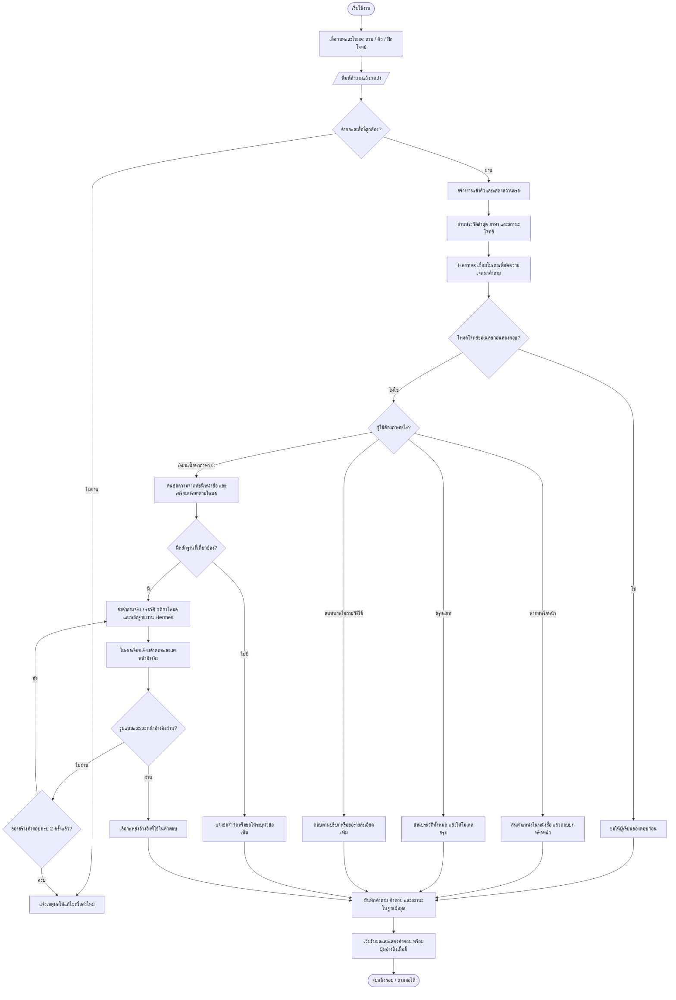

# C Companion: จากคำถามถึงคำตอบ

ตรวจจากโค้ดรุ่น1.7.0 เมื่อ9ตุลาคม2569 การปรับหน้าตาใน1.7.1ไม่เปลี่ยนกระบวนการนี้

## โฟลว์หลัก

เมื่อผู้ใช้กดหยุด งานหมดเวลา หรือบริการAIขัดข้อง ระบบเปลี่ยนสถานะงานและแจ้งผู้ใช้ เส้นทางล้มเหลวไม่บันทึกคู่คำถาม–คำตอบที่ยังไม่สำเร็จเป็นคำตอบปกติ ประวัติเดิมยังคงอยู่

## สิ่งที่เกิดขึ้นในแต่ละส่วน

1. **หน้าเว็บ React** ส่งข้อความต้นฉบับ บทและโหมดที่เลือก สร้างแชทเมื่อจำเป็น แล้วตรวจสถานะงานเป็นระยะ ไม่แสดงข้อความทีละโทเคน; แสดงคำตอบเมื่อระบบทำงานครบ
2. **เซิร์ฟเวอร์ Node.js** ตรวจsessionเจ้าของแชท รูปแบบข้อมูล ความยาวคำถาม คำขอข้ามเว็บไซต์ และงานที่ค้าง ระบบคิวตั้งต้นประมวลผลพร้อมกัน2งาน จำกัดงานค้างต่อsession2งาน ตัวเลขนี้ไม่ใช่จำนวนผู้ใช้สูงสุดที่รับรอง
3. **การตีความเจตนา** ใช้คำถามจริง ประวัติล่าสุดตามปกติ8ข้อความ ภาษา และบริบทโจทย์ ให้Hermesเชื่อมกับโมเดลที่ตั้งค่า หากตีความล้มเหลวมีเส้นทางสำรองตามกฎ/ขอคำถามชัดขึ้น ไม่ใช่ทุกคำถามจะเรียกโมเดลจำนวนครั้งเท่ากัน
4. **หาบทหรือหน้า** ตอบจากตำแหน่งหนังสือโดยตรงเมื่อหาเจอ จึงไม่บังคับให้อธิบายเนื้อหายาวในคำถามที่ต้องการเพียงเลขบท
5. **คำถามภาษาC** ค้นดัชนีข้อความที่เตรียมจากหนังสือ ใช้หัวข้อ บท คำค้นและประวัติช่วยจัดอันดับ ไม่ใช่การอ่านPDFทั้งเล่มใหม่ทุกครั้ง และไม่ได้ใช้vector databaseในระบบปัจจุบัน โจทย์เขียนโปรแกรมบางชนิดมีขั้นวางแผนหัวข้อเพิ่มก่อนเลือกบริบท
6. **โหมดติว/ฝึกโจทย์** เพิ่มคำสั่งเฉพาะโหมดและแหล่งอ้างอิงก่อนหน้า โหมดฝึกโจทย์ติดตามโจทย์กับคำตอบที่ผู้เรียนลองทำ เพื่อควบคุมการให้เฉลย
7. **การตรวจคำตอบ** ตรวจโครงสร้างข้อมูลและให้เลขหน้าอยู่ในชุดหลักฐานที่ส่งให้โมเดล สร้างใหม่ได้อีก1ครั้งหากไม่ผ่าน การตรวจนี้ไม่ได้พิสูจน์ว่าความหมายทุกประโยคหรือโค้ดทุกบรรทัดถูกต้อง
8. **SQLite และหน้าเว็บ** บันทึกคู่ข้อความและอัปเดตภาษา/สถานะโจทย์ในtransaction แล้วส่งผลกลับ หน้าเว็บแสดงบอทซ้าย ผู้ใช้ขวา และเปิดข้อความอ้างอิง/หนังสือได้

**Hermes** เป็นตัวกลางเชื่อมกับโมเดลที่ตั้งค่า ส่วนเว็บนี้รับผิดชอบประวัติ คิว ค้นหนังสือ กติกาโหมด ตรวจคำตอบ และแสดงผล ไม่ควรระบุว่าเป็นChatGPTรุ่นใดโดยไม่มีหลักฐานค่าตั้งปัจจุบัน

## พร้อมใช้งานแค่ไหน

**พร้อมเริ่มใช้ในกลุ่มเล็กแบบมีผู้ดูแล** สำหรับช่วยเรียนภาษาC ยังไม่ใช่การรับรองใช้แทนผู้สอน ระบบสอบ หรือบริการสาธารณะขนาดใหญ่

| หลักฐานล่าสุดของ1.7.0 | ผล |
|---|---|
| ทดสอบระบบและกฎการทำงาน | 128/128 ผ่าน |
| กรณีค้นหนังสือแบบอัตโนมัติ | 24/24 ผ่าน |
| ทดสอบการทำงานผ่านเบราว์เซอร์/HTTP | 36/36 ผ่าน |
| รวมชุดทดสอบข้างต้น | 188/188 หรือ100%ของชุดทดสอบนี้ |
| TypeScript / สร้างเว็บ / CI | ผ่าน |
| หลังเผยแพร่ | ตรวจรุ่นตรง ระบบhealthy สำรองและตรวจrestoreสำเนาผ่าน |

**100%ของชุดทดสอบไม่ใช่100%ความพร้อมหรือความแม่นยำAI** กรณีทดสอบครอบคลุมขอบเขตจำกัดและบางกรณีใช้บริการAIจำลอง ปัจจุบันยังไม่มีผลประเมินคำตอบจริงชุดใหญ่ใหม่ที่ผูกกับรุ่น1.7.0 จึงไม่กำหนดเปอร์เซ็นต์ความแม่นยำ/ความพร้อมรวมขึ้นเอง และไม่ย้ายตัวเลขของชุดวิจัยรุ่นก่อนมาอ้างเป็นผลของรุ่นนี้

ก่อนขยายการใช้งาน ควรตรวจคำตอบจริงครบ12บทด้วยเกณฑ์ที่ชัดเจน ทดสอบจำนวนผู้ใช้และระยะเวลาที่คาดว่าจะใช้งานจริง และเก็บผลจากผู้เรียนจริงแยกจากข้อมูลตัวอย่าง หากห้องมี30คน ควรทยอยเริ่มใช้; ผล20sessionกับบริการจำลองไม่รับรอง30คนส่งคำถามพร้อมกันกับโมเดลจริง ระบบยังใช้sessionเบราว์เซอร์ ไม่มีบัญชีหรือกู้ประวัติข้ามเครื่อง

## การตรวจเพิ่มเติมระหว่างปรับ1.7.1

ทดสอบซ้ำ128+24+36กรณีผ่านครบ พร้อมTypeScript/build หลังแก้ไอคอนและdependency ดูหลักฐานเผยแพร่ใน[Release1.7.1](https://github.com/s6702041610258/c-companion/releases/tag/v1.7.1)

พบsource-map-js1.2.1ในสายdependencyของVite/PostCSS ซึ่งใช้สร้างเว็บ อัปเป็น1.2.2ตาม[ประกาศแก้ช่องโหว่](https://github.com/advisories/GHSA-68fv-2mgg-jv7q) แล้วnpm auditรายงาน0รายการ ณ เวลาตรวจ Docker runtimeไม่คัดลอกnode_modulesจากขั้นbuild ผลนี้ไม่ใช่การรับรองความปลอดภัยทั้งระบบ

## แหล่งตรวจสอบ

- [เซิร์ฟเวอร์และลำดับประมวลผล](../app/server.mjs)
- [คิวงานและเวลารอ](../app/jobs.mjs)
- [ตีความคำถาม](../app/conversation-router.mjs)
- [ค้นหนังสือ](../app/retrieval.mjs)
- [ค้นบทและหน้า](../app/book-location.mjs)
- [ตรวจคำตอบและลองใหม่](../app/answer-validation.mjs)
- [หน้าเว็บและรับผล](../web/src/main.tsx)
- [CI1.7.0](https://github.com/s6702041610258/c-companion/actions/runs/37949974205)
- [ผลเผยแพร่1.7.0](https://github.com/s6702041610258/c-companion/releases/tag/v1.7.0)
